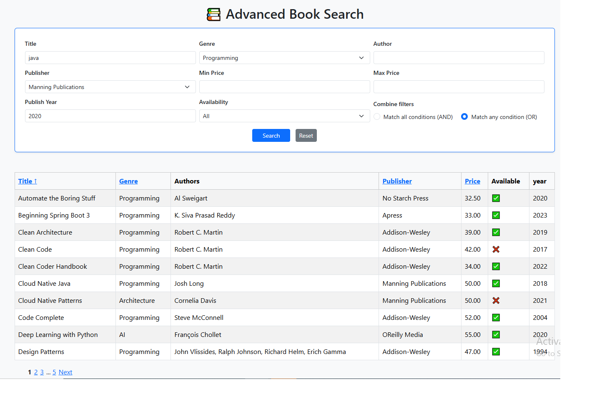

# 📚 Advanced Book Search



A **Spring Boot** project demonstrating advanced search functionality for books using **JPA Specifications** to create a dynamic, multi-criteria search form.

The search form allows users to filter books by title, genre, author, publisher, price range, availability, and publish year.  
The results table supports dynamic sorting by clicking on the column headers — toggling between ascending and descending order — making it easy to explore and find books efficiently.

---

## ✨ Features

- 🔍 **Advanced search** with dynamic filtering  
- ⚙️ Supports **AND / OR** operators for combining search conditions  
- 📄 **Pagination and sorting** built-in  
- ⚠️ **Global exception handling** with custom 404 and error pages  
- 🧩 **Simple DTO mapping** with `BookMapper`  
- ✅ **Validation** for search inputs  

---

## 🧠 Technologies Used

- Java 17+
- Spring Boot 3.x
- Spring Data JPA
- H2 in-memory database
- Thymeleaf
- Bootstrap 5

---

## 🚀 How to Run

### 1️⃣ Clone the repository
```bash
git clone https://github.com/shirinjamshidiyan/Spring-Boot-Sample-Code.git
cd Spring-Boot-Sample-Code/AdvancedSearch-JpaSpecification
```

### 2️⃣ Build the project
```bash
mvn clean install
```

### 3️⃣ Run the app
```bash
mvn spring-boot:run
```

### 4️⃣ Open in browser
👉 [http://localhost:8080/books](http://localhost:8080/books)

---

## 🗄️ H2 Database Console

Accessible at:  
👉 [http://localhost:8080/h2-console](http://localhost:8080/h2-console)

- **JDBC URL:** `jdbc:h2:mem:bookdb`  
- **User:** `sa`  
- **Password:** *(empty)*  

---

## 📝 Notes

- This is a **sample project**, focused mainly on advanced search with specifications, paging, and sorting.  
- Validation errors are shown above the search form.  
- Invalid URLs show a custom **404 page**.

---

### 📷 Screenshot

